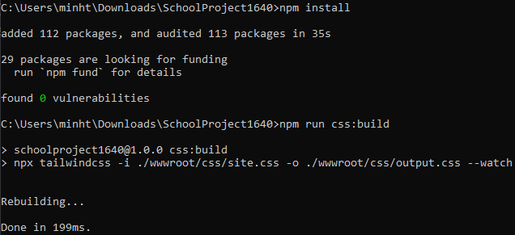

# Sử dụng Tailwind CSS

1. Đầu tiên chạy lệnh ```npm install``` trong thư mục project gốc 
2. Chạy lệnh ```npm run css:build``` trong thư mục project gốc trước khi chạy project
   
3. Nhấn chạy project bình thường trong Visual Studio
4. Khi chạy project, giữ command prompt chạy để nó update CSS khi mình thay đổi class trong mấy file của mình
5. Nó chạy xong thì mình nhấn nút Hot Reload trong Visual Studio để nhìn thấy sự thay đổi 

# Dành cho FE

Hiện tại Tailwind CSS đã được cài vào project rồi mà chưa được kích hoạt để dễ nhìn. Khi nào mấy ông FE làm thì vào file _Layout.cshtml đầu tiên mục head bỏ comment dòng này

```html
@* <link rel="stylesheet" href="~/css/output.css" asp-append-version="true" /> *@
```

Bỏ comment xong thì Tailwind CSS sẽ được áp dụng vào project mà mấy class của nó sẽ bị trùng với Bootstrap nên mình có thể bỏ bootstrap bằng cách comment 2 dòng này 

```html
<head>
    ...
    <link rel="stylesheet" href="~/lib/bootstrap/dist/css/bootstrap.min.css" />
    <script src="~/lib/bootstrap/dist/js/bootstrap.bundle.min.js"></script>
    ...
</head>
```